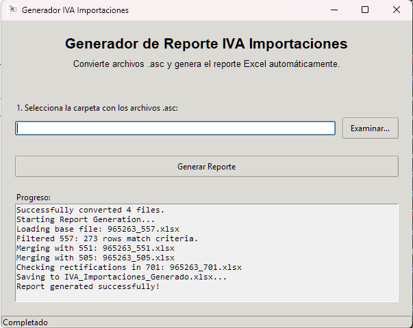

# Generador de IVA Importaciones



Este repositorio contiene la herramienta para generar reportes de IVA de importaciones a partir de archivos `.asc` (Data Stage/Glosa).

## Descripción

La aplicación procesa archivos `.asc` (557, 551, 505, 701), los convierte a formato Excel y genera un reporte consolidado `IVA_Importaciones_Generado.xlsx` con la información requerida, incluyendo:
- Cálculo de IVA pagado.
- Cruce de información de proveedores y valores comerciales.
- Identificación de pedimentos rectificados.

## Estructura del Proyecto

- `gui_app.py`: Aplicación principal con interfaz gráfica (GUI) que integra todo el proceso.
- `convert_asc_to_xlsx.py`: Script independiente para convertir archivos `.asc` a `.xlsx`.
- `generator_iva.py`: Script independiente para generar el reporte final desde los archivos `.xlsx`.
- `create_icon.py`: Utilidad para generar el icono de la aplicación.
- `instructions.txt`: Documentación original de la lógica de negocio.

## Requisitos (Para Ejecutar el Código Fuente)

- Python 3.12+
- Librerías necesarias:
  ```bash
  pip install pandas openpyxl numpy pillow
  ```

## Uso

### Opción 1: Ejecutar desde el código fuente
1. Asegúrate de tener las librerías instaladas.
2. Ejecuta la aplicación gráfica:
   ```bash
   python gui_app.py
   ```
3. En la ventana que aparece, selecciona la carpeta donde se encuentran tus archivos `.asc`.
4. Haz clic en "Generar Reporte".

### Opción 2: Generar el Ejecutable (.exe)
Si deseas crear un archivo ejecutable para usar sin instalar Python:
1. Instala PyInstaller:
   ```bash
   pip install pyinstaller
   ```
2. Ejecuta el comando de construcción:
   ```bash
   pyinstaller --noconfirm --onefile --windowed --icon "logo.ico" --name "IVA Importaciones Gen" --add-data "logo.ico;." gui_app.py
   ```
   *Nota: Necesitas tener el archivo `logo.ico` en el directorio. Puedes generarlo ejecutando `python create_icon.py` si tienes el archivo de origen `logo 3zg IVA IMP.jpg`.*

3. El ejecutable se creará en la carpeta `dist/`.

## Ejecutable (.exe)

Este repositorio incluye una versión compilada lista para usar: `IVA Importaciones Gen.exe`.

**Nota Importante de Seguridad:**
Al descargar y ejecutar este archivo, es posible que tu antivirus (como Windows Defender o SmartScreen) lo bloquee o muestre una advertencia. Esto es normal porque el archivo no está firmado digitalmente con un certificado de pago.

Para usarlo:
1. Si aparece "Windows protegió su PC", haz clic en "Más información" y luego en "Ejecutar de todas formas".
2. Si prefieres no ejecutar el `.exe`, puedes seguir las instrucciones de "Uso: Opción 1" para correr el código fuente con Python, lo cual es completamente transparente y seguro.

## Licencia

Este proyecto está bajo la Licencia MIT. Ver el archivo [LICENSE](LICENSE) para más detalles.
